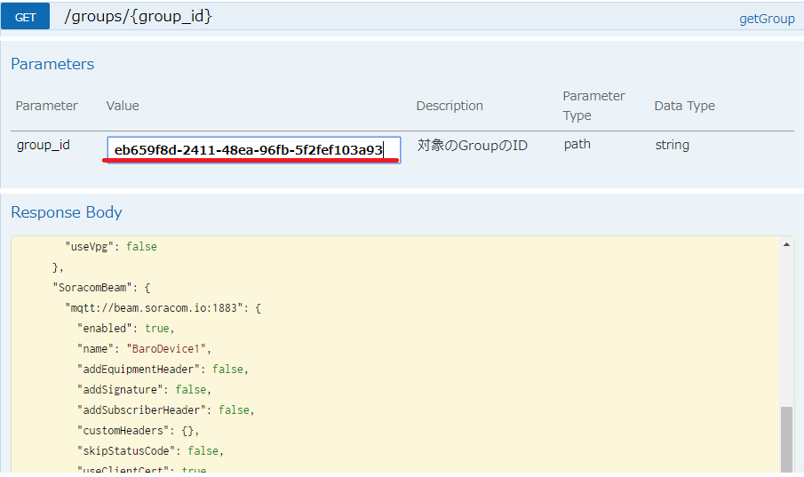
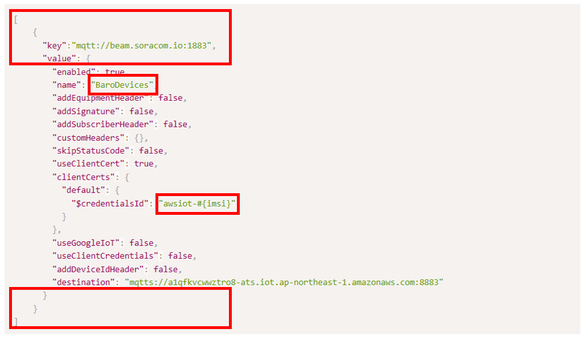
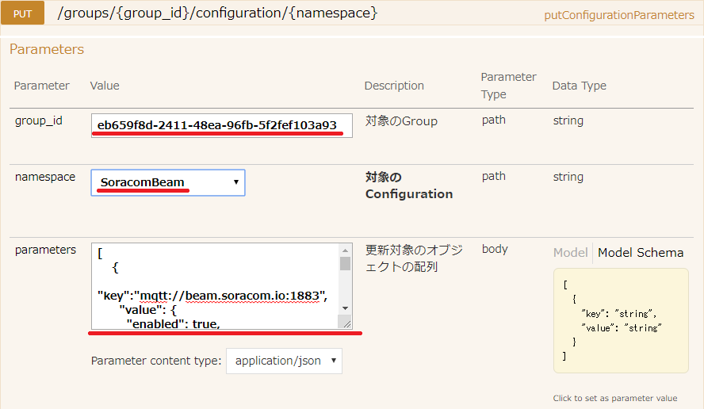
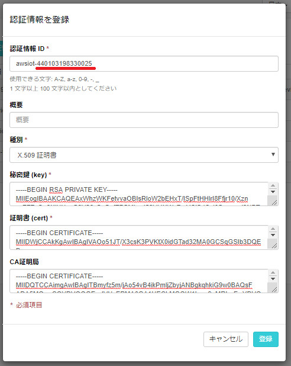
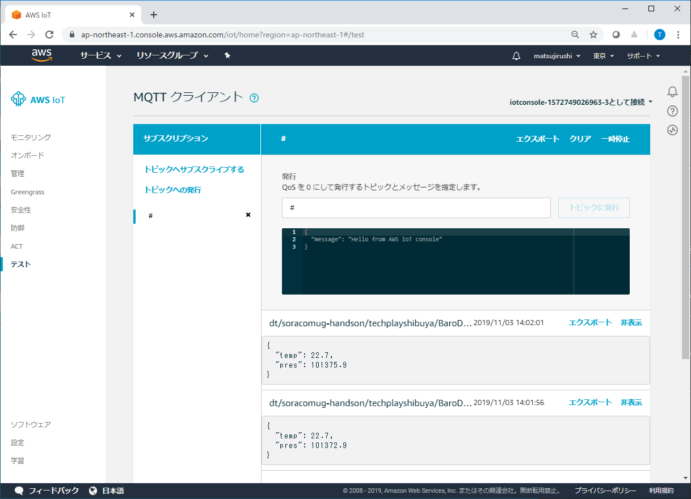

## 4. SIMグループ増殖を防ぐ

### <a name="4-1">4-1. デバイスを増やしたときに追加しなければいけないSORACOMの設定を調べてください。</a>

(TODO)

***

### <a name="4-2">4-2. SIMグループを増やさなくても済む方法を考えてください。</a>

(TODO)

***

### <a name="4-3">4-3. SIMグループの設定をAPIで取得してください。</a>

[SORACOM APIリファレンス](https://dev.soracom.io/jp/docs/api/)を開き、メールアドレスとパスワードを入力して、「認証」をクリックしてください。  
「認証」ボタンの下に、「認証OK」と表示されれば成功です。

getGroup（GET /groups/{group_id}）のところで、「group_id」に「soracomug-handson」SIMグループのIDを入力して、「Try it out!」をクリックしてください。  
SIMグループのIDが分からないときは、SORACOMコンソールのSIMグループ画面で確認してください。



「Response Body」に表示された、「"SoracomBeam"」の部分を、テキスト編集ソフトにコピーしてください。

**例**
```json
    "SoracomBeam": {
      "mqtt://beam.soracom.io:1883": {
        "enabled": true,
        "name": "BaroDevice1",
        "addEquipmentHeader": false,
        "addSignature": false,
        "addSubscriberHeader": false,
        "customHeaders": {},
        "skipStatusCode": false,
        "useClientCert": true,
        "clientCerts": {
          "default": {
            "$credentialsId": "BaroDevice1"
          }
        },
        "useGoogleIoT": false,
        "useClientCredentials": false,
        "addDeviceIdHeader": false,
        "destination": "mqtts://a1qfkvcwwztro8-ats.iot.ap-northeast-1.amazonaws.com:8883"
      }
    }
```

***

### <a name="4-4">4-4. SORACOM Beamの設定を切り出して、クレデンシャルIDを変更してください。</a>

取得した「"SoracomBeam"」の部分を、putConfigurationParameters（PUT /groups/{group_id}/configuration/{namespace}）のparametersで指定できる形に修正して、「name」と「$credentialsId」を変更してください。

**変更箇所**



**変更後（例）**
```json
[
    {
      "key":"mqtt://beam.soracom.io:1883",
      "value": {
        "enabled": true,
        "name": "BaroDevices",
        "addEquipmentHeader": false,
        "addSignature": false,
        "addSubscriberHeader": false,
        "customHeaders": {},
        "skipStatusCode": false,
        "useClientCert": true,
        "clientCerts": {
          "default": {
            "$credentialsId": "awsiot-#{imsi}"
          }
        },
        "useGoogleIoT": false,
        "useClientCredentials": false,
        "addDeviceIdHeader": false,
        "destination": "mqtts://a1qfkvcwwztro8-ats.iot.ap-northeast-1.amazonaws.com:8883"
      }
    }
]
```

***

### <a name="4-5">4-5. SIMグループに変更したSORACOM Beamの設定を設定してください。</a>

SORACOM APIリファレンスのputConfigurationParameters（PUT /groups/{group_id}/configuration/{namespace}）のところで、
「group_id」に「soracomug-handson」SIMグループのID、
「namespace」を「SoracomBeam」、
「parameters」にさきほどのテキストを入力して、
「Try it out!」をクリックしてください。


***

### <a name="4-6">4-6. SORACOM認証情報ストアに認証情報を追加してください。</a>

[**2-5**](2.md#2-5)と同様に、認証情報ID「awsiot-`IMSI`」の認証情報を追加してください。  
`IMSI`の部分は、Wio LTEに差しているSIMのIMSI番号を入力してください。



***

### <a name="4-7">4-7. Wio LTEを動かしてください。</a>

(TODO)

***

### <a name="4-8">4-8. AWS IoT Coreに絶対圧が届いていることを確認してください。</a>



***
